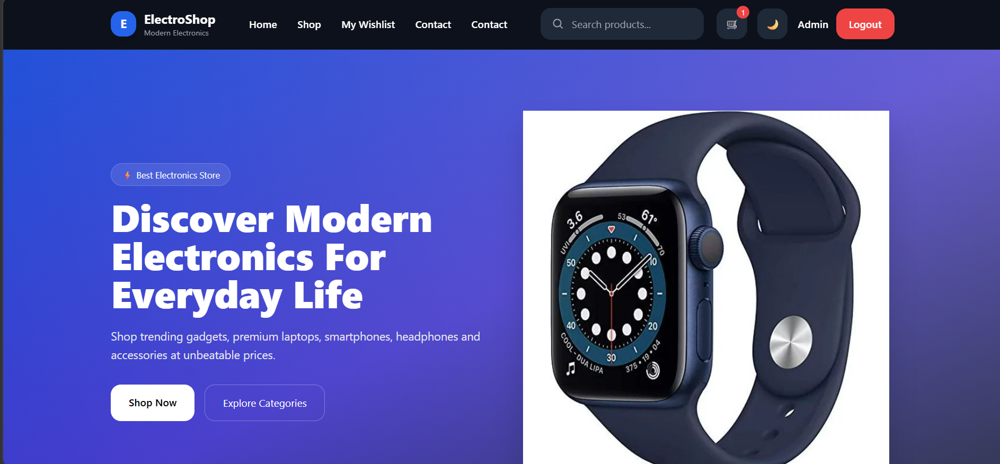
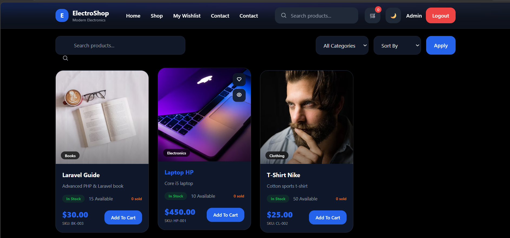
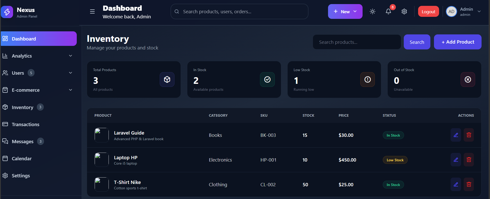
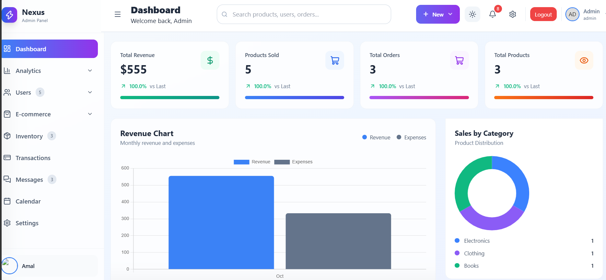
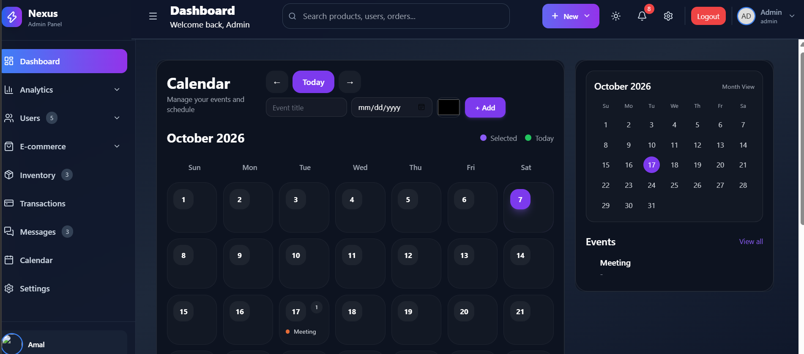
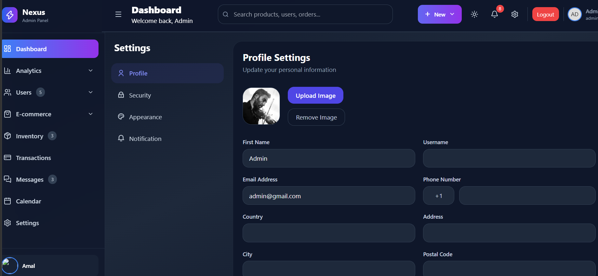
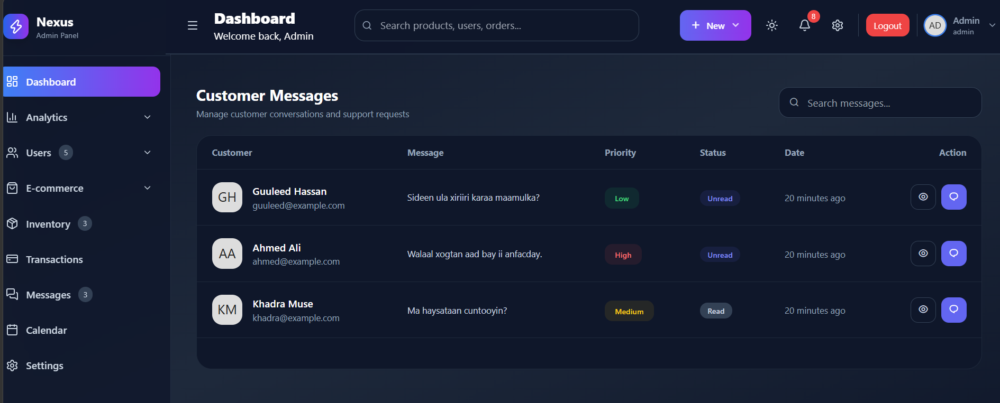
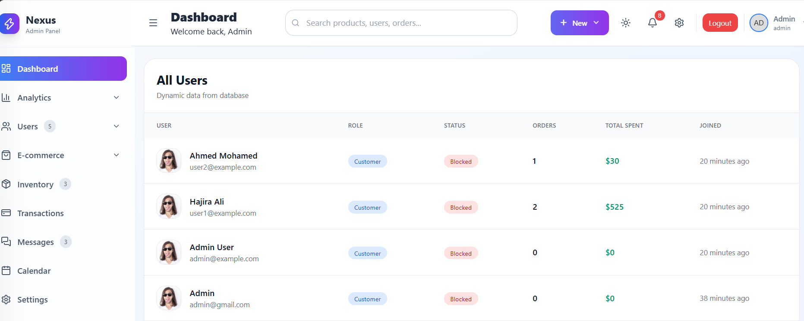
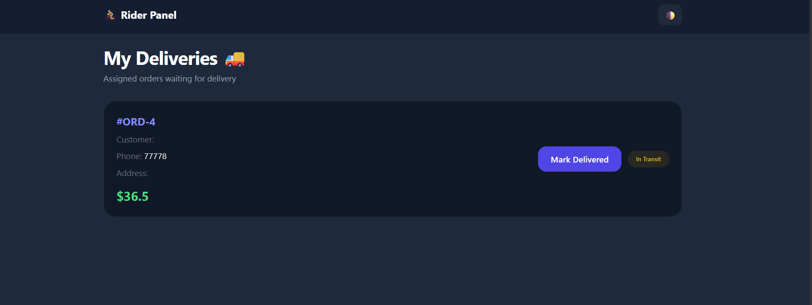

# 🛍️ Laravel E-Commerce Platform

<p align="center">
  <strong>Modern E-Commerce & Business Management System</strong>
</p>

<p align="center">
  A full-stack e-commerce platform built with Laravel, Tailwind CSS and MySQL, combining online shopping with complete business, inventory, order and delivery management.
</p>

<p align="center">
  
  
  
</p>

---

## ✨ About

A complete e-commerce and business management system designed to manage the entire store workflow — from products and customers to orders, inventory, communication and delivery.

The platform supports **Admin, Customer and Rider** workflows through a modern responsive interface.

---

## 🚀 Features

* 🛒 Modern online shopping experience
* 📊 Business dashboard
* 🛍️ Product management
* 📦 Order management
* 📋 Inventory management
* 👥 User management
* 💬 Messaging system
* 📅 Calendar & scheduling
* ⚙️ Application settings
* 🚚 Rider & delivery management
* 🔐 Role-based access
* 📱 Responsive design

---

## 📸 Project Preview

<p align="center">
  
  
</p>

<p align="center">
  
  
</p>

<p align="center">
  
  
</p>

<p align="center">
  
  
</p>

<p align="center">
  
  
</p>
---

## 🧩 Main Modules

| Module             | Purpose                      |
| ------------------ | ---------------------------- |
| 🏠 Home            | Customer storefront          |
| 🛍️ Products       | Product & catalog management |
| 📦 Orders          | Order processing             |
| 📊 Dashboard       | Business overview            |
| 📅 Calendar        | Scheduling & activities      |
| ⚙️ Settings        | System configuration         |
| 💬 Messages        | Communication                |
| 📋 Inventory       | Stock management             |
| 👥 Users           | User management              |
| 🚚 Rider Dashboard | Delivery operations          |

---

## 👥 User Roles

**Admin** — Full business and system management
**Customer** — Shopping and order activities
**Rider** — Delivery and assigned orders

---

## 🛠️ Tech Stack

**Laravel · PHP · Blade · Tailwind CSS · MySQL · JavaScript · Vite · Eloquent ORM**

---

## 🔄 Workflow

```text
Products → Orders → Inventory → Delivery → Customer
                    ↓
              Admin Dashboard
```

---

## 👩‍💻 Developer

**Hajira Yousuf Ali**
Software Engineering Student | Full-Stack Developer

<p align="center">
  <a href="https://github.com/HajiraYousuf">
    GitHub
  </a>
</p>

---

<p align="center">
  <strong>Built with Laravel & Tailwind CSS ❤️</strong>
</p>
